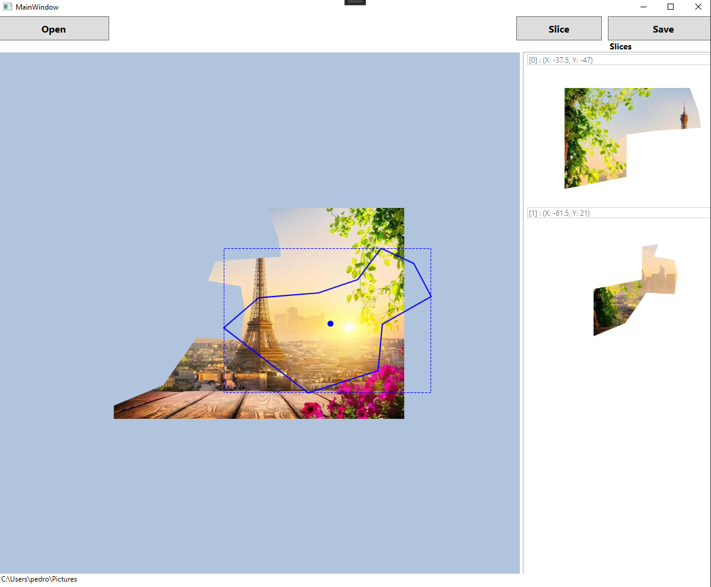

# Polygonal Image Cropping Tool (WPF)
WPF lightweight image editing tool that supports precise polygon-based cropping.

## How it works
- Use the mouse to make lasso selections.
- Click slice to carve out the selection and create a slice item.
- When you're done, click Save. This will create the slice images in the same folder, alongside a json file with slice metadata.
